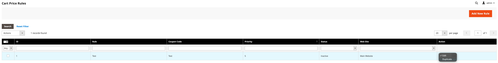
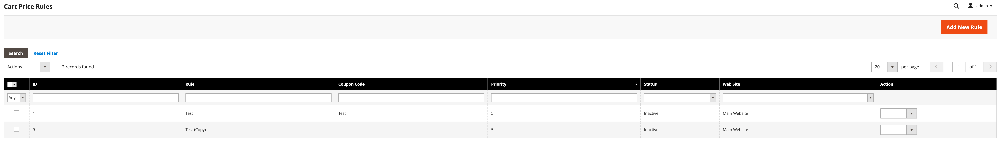
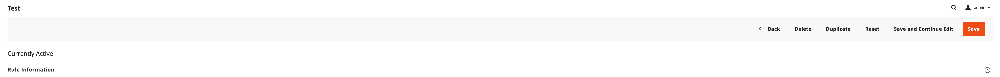

<h1 align="center">SchrammelCodes_SalesRule</h1> 

<div align="center">
    <p>Streamline your promotional rule management with powerful duplication and mass management features for Magento 2 Cart Price Rules.</p>
    
    <a href="https://packagist.org/packages/schrammel-codes/magento2-salesrule" target="_blank"></a>
    <a href="https://packagist.org/packages/schrammel-codes/magento2-salesrule" target="_blank"></a>
    <a href="https://github.com/schrammel-codes/magento2-salesrule/graphs/commit-activity" target="_blank"></a>
    <a href="https://opensource.org/licenses/MIT" target="_blank"></a>
</div>

## What This Module Does

This module extends Magento 2's Cart Price Rules (promotional discounts) with convenient management features that save time and reduce errors when managing multiple similar promotions.

### Key Features

**1. Duplicate Cart Price Rules**

Create copies of existing promotional rules with a single click. Perfect for:
- Creating seasonal variations of successful promotions
- Setting up similar rules for different customer segments
- Testing rule variations without risking the original configuration

**2. Mass Actions**

Manage multiple rules at once:
- **Mass Duplicate**: Copy several rules simultaneously
- **Mass Delete**: Remove multiple outdated rules in one action
- **Mass Status Change**: Enable or disable multiple rules at once

### How It Works

#### Smart Duplication

When you duplicate a rule, the module:
- ✅ Copies all rule conditions and actions
- ✅ Copies customer group associations
- ✅ Copies website assignments
- ✅ Copies store-specific labels
- ✅ Adds "(Copy)" suffix to the rule name
- 🔄 Resets coupon code
- 🔄 Resets usage counter to zero
- 🔄 Clears start and end dates (you set new dates for the copy)
- 🔄 Generates a new rule ID automatically

This ensures your duplicated rules are ready to customize without inheriting usage history or active date ranges.

## Benefits for Store Administrators

### Time Savings
Instead of manually recreating complex promotional rules with dozens of conditions, duplicate existing ones and adjust only what's needed. A task that might take 15-20 minutes now takes seconds.

### Consistency
Duplicating rules ensures all settings, conditions, and actions are copied exactly, reducing human error when creating similar promotions.

### Flexibility
Quickly test variations of successful promotions or create region-specific versions of global campaigns without starting from scratch.

### Efficiency
Mass actions let you manage multiple rules at once - perfect for seasonal cleanup, enabling holiday promotions, or deactivating expired campaigns.

## Usage Guide

### Duplicate a Single Rule



1. Navigate to **Marketing > Promotions > Cart Price Rules**
2. Find the rule you want to duplicate
3. Click **Select** in the Actions column
4. Choose **Duplicate**
5. The duplicated rule appears in the grid with "(Copy)" appended to its name



### Duplicate from Rule Edit Page



1. Open any Cart Price Rule for editing
2. Click the **Duplicate Rule** button (next to Save/Delete)
3. You'll be redirected to the edit page of the newly created copy
4. Customize the copy as needed and save

### Mass Duplicate Multiple Rules

1. In the Cart Price Rules grid, select checkboxes for rules you want to duplicate
2. Open the **Actions** dropdown (top left of grid)
3. Select **Duplicate**
4. Click **Submit**
5. All selected rules are duplicated at once

### Mass Delete Rules

1. Select rules to delete using checkboxes
2. Choose **Delete** from the Actions dropdown
3. Confirm the deletion
4. Selected rules are permanently removed

### Mass Status Change

1. Select rules to enable or disable
2. Choose **Change Status** from the Actions dropdown
3. Select **Enabled** or **Disabled**
4. Click **Submit**
5. All selected rules are updated immediately

## Installation

```bash
# Enable the module
bin/magento module:enable SchrammelCodes_SalesRule

# Run setup upgrade
bin/magento setup:upgrade

# Clear cache
bin/magento cache:clean
```
### Permissions

The module adds a new ACL resource:
- `SchrammelCodes_SalesRule::quote_duplicate` - Permission to duplicate cart price rules

Grant this permission to admin roles that should be able to duplicate promotional rules.

## Compatibility

- **Magento 2.4.x** (Open Source)
- **PHP 8.1, 8.2, 8.3**

> ### For Magento Commerce installations
> To ensure proper reset of staging preview data, install the companion module **SchrammelCodes_SalesRuleCommerce**
> to ensure proper handling of staging fields.

## Technical Information
